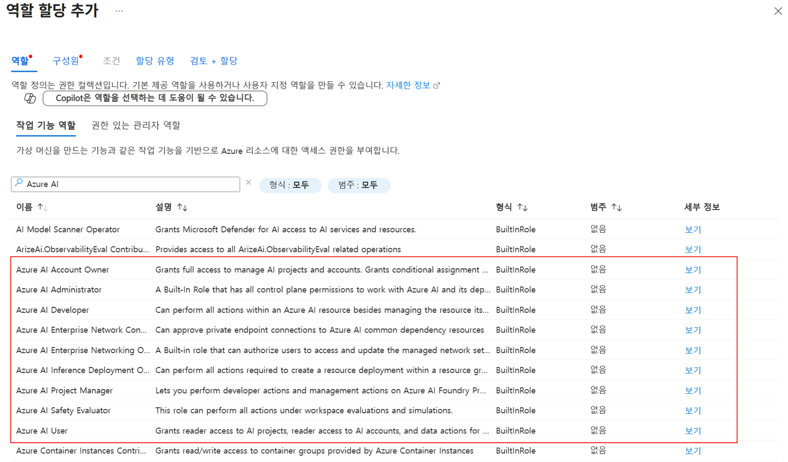
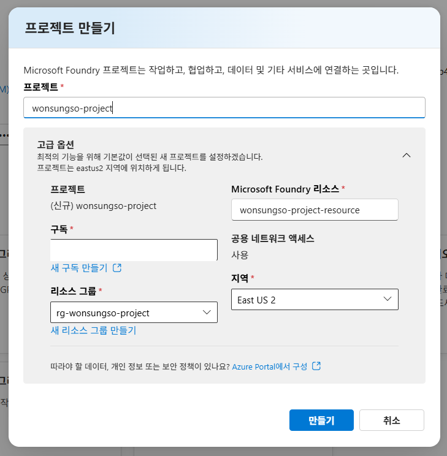

# 1. Microsoft Foundry 구성

이 모듈은 Foundry 프로젝트를 만들고, 이후 실습에서 사용할 Azure 리소스를 준비하기 위한 시작 단계입니다.

## Microsoft Foundry 권한 구성

1. [Azure 포털](https://portal.azure.com)에 로그인합니다.
2. 상단 검색창에서 `구독`을 검색해 사용할 구독을 엽니다.
3. 왼쪽 메뉴에서 `액세스 제어(IAM)`를 클릭합니다.
4. `추가` > `역할 할당 추가`를 클릭합니다.
5. 역할 검색창에서 `Azure AI`를 검색하여 아래 역할 중 필요한 것을 선택합니다.
   - `Azure AI User` – 프로젝트 데이터 작업 및 읽기 권한
   - `Azure AI Developer` – 리소스 관리를 제외한 전체 작업 권한

6. 구성원 유형은 `사용자, 그룹 또는 서비스 주체`를 선택합니다.
7. 본인 계정을 선택하고 `검토 + 할당`을 완료합니다.

## 새 Foundry 프로젝트 생성

1. [Microsoft Foundry 포털](https://ai.azure.com/)에 접속합니다.
확인합니다.
2. 홈 화면에서 `프로젝트 만들기`를 클릭합니다.
3. 프로젝트 이름을 입력합니다. 예시는 `<alias>-project` 형식을 사용합니다.
4. `고급 옵션`을 열고 지역을 `East US 2`로 선택합니다.
5. 나머지 옵션은 기본값으로 두고 `만들기`를 클릭합니다.
6. 프로젝트 생성이 완료될 때까지 잠시 기다립니다.

## 프로젝트 정보 확인

1. 프로젝트가 열리면 좌측 상단의 프로젝트 이름을 클릭합니다.
2. 드롭다운 메뉴에서 `프로젝트 세부 정보`를 클릭합니다.
3. 프로젝트 이름, 지역, 연결된 리소스를 확인합니다.
4. 이후 실습에서 반복해서 사용할 **리소스 그룹 이름**을 메모해 둡니다.
5. 필요하면 새 브라우저 탭에서 [Azure 포털](https://portal.azure.com)을 열고 같은 리소스 그룹이 생성되었는지 확인합니다.

## 이후 모듈에서 사용할 포털 내비게이션

- **검색** 또는 **모델**: 모델 탐색 및 배포
- **빌드**: 플레이그라운드, 에이전트 작업
- **작업 > 관리자**: 연결, 운영 리소스 관리
- **평가**: 평가 실행 및 결과 확인

이제 1번 모듈 실습(Microsoft Foundry 구성)이 완료되었습니다.

다음 모듈에서 모델을 배포하고 플레이그라운드를 활용해 보겠습니다.

➡️ [2. 플레이그라운드 활용해보기](./../2.%20플레이그라운드%20활용해보기/README.md)