# 2. 플레이그라운드 활용해보기

# 재테크 상담 지원 봇 구성해보기

이 실습에서는 [Microsoft Foundry 포털](https://ai.azure.com/)의 **채팅 플레이그라운드**를 이용해 재테크 상담 지원 봇을 구성합니다. 목표는 다음과 같습니다.

- 금융 상담용 기본 시스템 프롬프트 작성
- 모델 배포 및 플레이그라운드 테스트
- 플레이그라운드 내 파일업로드를 사용한 RAG 구성
- 금융 문서를 바탕으로 답변의 근거성과 검색 품질 확인

## 모델 배포

1. [Microsoft Foundry 포털](https://ai.azure.com/)에 접속합니다.
2. 상단 메뉴의 `검색` 클릭 후 왼쪽 메뉴의 `모델`에서 모델을 찾습니다.
3. 검색창에서 `gpt-4o`를 검색하고 모델 카드를 엽니다.
4. `배포` > `사용자 지정 설정`을 클릭합니다.
5. 배포 이름은 기본값 `gpt-4o` 를 사용하거나 `gpt-4o-finance`처럼 식별 가능한 이름을 입력합니다.


6. 배포가 완료되면 자동으로 **플레이그라운드**로 이동합니다.
7. 동일한 방식으로 임베딩 모델 `text-embedding-3-large` 도 배포합니다.

## 초기 프롬프트 구성

채팅 플레이그라운드에서 시스템 프롬프트를 먼저 구성한 뒤, 이후 데이터 연결을 추가합니다.

1. 다시 생성한 `gpt-4o`의 플레이그라운드로 이동합니다.

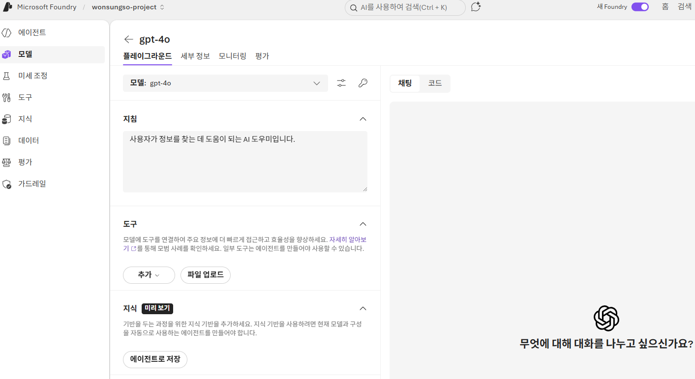

2. 채팅 플레이그라운드의 `지침` 영역에 아래 프롬프트를 붙여 넣습니다.

```text
당신은 대한민국 은행의 금융상품 전문가 챗봇입니다. 고객이 예금, 적금, 펀드, 대출 등 금융상품에 대해 질문하면, 다음 기준을 준수하여 답변해 주세요:

정확한 최신 정보 제공 - 상품 금리, 만기, 우대 조건 등을 가능한 최근 기준으로 제시할 것.

정보 출처 명시 - "은행 내부 상품 카탈로그" 또는 "업로드된 금융 상품 문서"처럼 출처를 밝힐 것.

비교와 계산 - 가능하면 간단한 비교표 또는 계산 예제를 포함할 것.

고객 이해도 고려 - 어려운 금융 용어는 풀어 설명하고, 선택지를 판단할 수 있도록 장단점을 제시할 것.

정책과 규제 준수 - 개인정보 보호, 약관, 금리 고지 사항 등을 반영하여 설명할 것.
```

3. 변경 내용을 적용합니다.
4. 데이터 연결 전에는 아래 질문으로 모델 자체 응답을 먼저 확인합니다.

```text
정기예금과 적금의 차이를 간단히 설명해 주세요. 각각의 장점과 단점을 알려주세요.

펀드와 ETF의 주요 차이점과 투자 시 유의해야 할 리스크를 3가지씩 설명해 주세요.

대한민국에서 은행 예금은 어느 기관이 예금자보호를 담당하며, 한도는 얼마인가요?

주택담보대출의 LTV와 DSR 규제의 개념과 현재 한국 금융권에서의 적용 방식을 설명해 주세요.

고객이 월 100만원씩 1년간 예금할 때 단리 3%와 복리 3%의 예상 이자를 비교해 주세요.
```

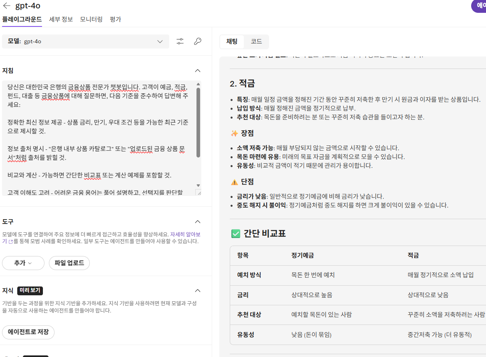

## RAG +데이터 추가 구성

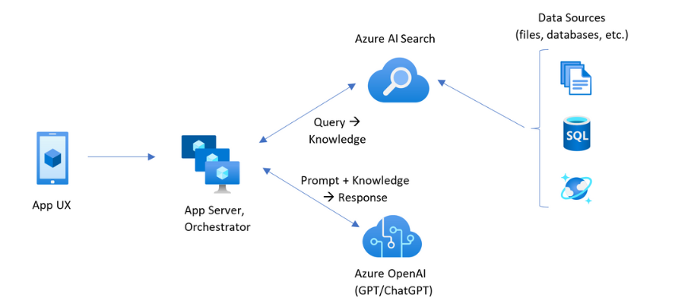

한국 금융상품 중심으로 접근 가능한 공개 데이터 및 데이터 상품을 다운로드하여 데이터를 추가해 보도록 하겠습니다.

### Azure AI Search 구성

1. 새 탭에서 [Azure 포털](https://portal.azure.com)을 엽니다.
2. `AI Search`을 검색한 뒤 새 리소스를 만듭니다.
3. 다음과 같이 구성합니다.

- 구독: 현재 구독
- 리소스 그룹: 앞 단계에서 만든 리소스 그룹
- 서비스 이름: `aisearch-<alias>`
- 위치: `East US2` 혹은 `Central US 등 `표준 계층 지원 리전

> 중요
> 가격 책정 계층은 생성 후 변경할 수 없으므로 반드시 `표준`으로 선택 확인 뒤 생성합니다.

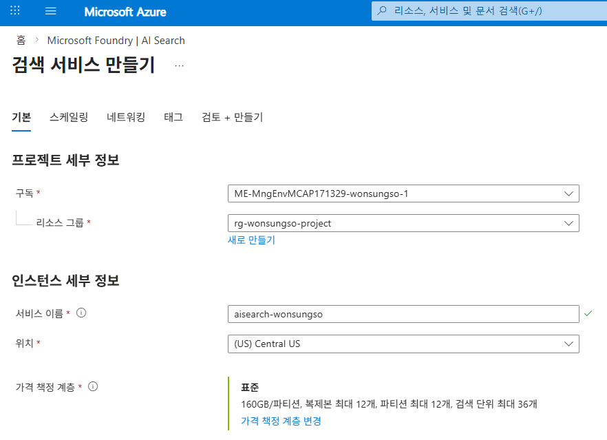

4. 생성이 완료되면 리소스로 이동합니다.
5. `설정 > 키`에서 API 액세스 제어가 제한적이라면 `모두` 로 변경 합니다.

#### AI Search ID 할당

1. Azure AI Search 리소스의 왼쪽 메뉴에서 `ID`를 클릭합니다.
2. `시스템 할당` 상태를 `켜기`로 변경합니다.
3. `저장`을 클릭해 변경 사항을 반영합니다.

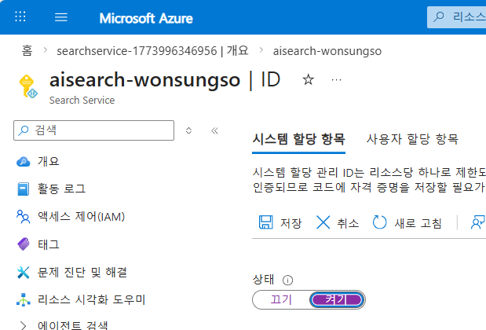

### Azure Storage 구성

1. [Azure 포털](https://portal.azure.com)에서 `스토리지 계정`을 검색합니다.
2. 새 스토리지 계정을 생성합니다.
3. 다음과 같이 구성합니다.

- 구독: 사용할 구독
- 리소스 그룹: 앞 단계에서 만든 리소스 그룹
- 스토리지 계정 이름: `st<alias>project`
- 지역: `(US) East US 2`
- 성능: `표준`
- 중복도: `LRS(로컬 중복 스토리지)`

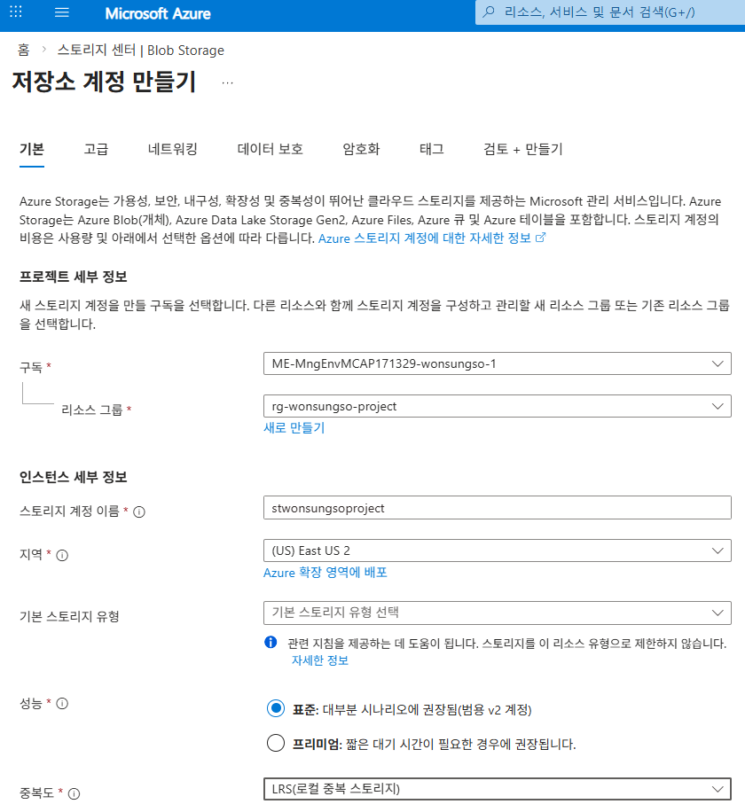

4. 생성이 완료되면 리소스로 이동합니다.

## 프로젝트 연결 확인

[Microsoft Foundry 포털](https://ai.azure.com/)에서 외부 리소스를 프로젝트 단위로 재사용하려면 연결을 만들어 두는 편이 좋습니다.

1. [Microsoft Foundry 포털](https://ai.azure.com/)에서 우측 상단 `작업`을 클릭합니다.
2. 왼쪽 메뉴에서 `관리자`를 클릭합니다.
3. 프로젝트 목록에서 현재 프로젝트를 선택합니다.
4. 가운데 `연결된 리소스`를 선택한 후 `연결 추가` 버튼을 클릭합니다.

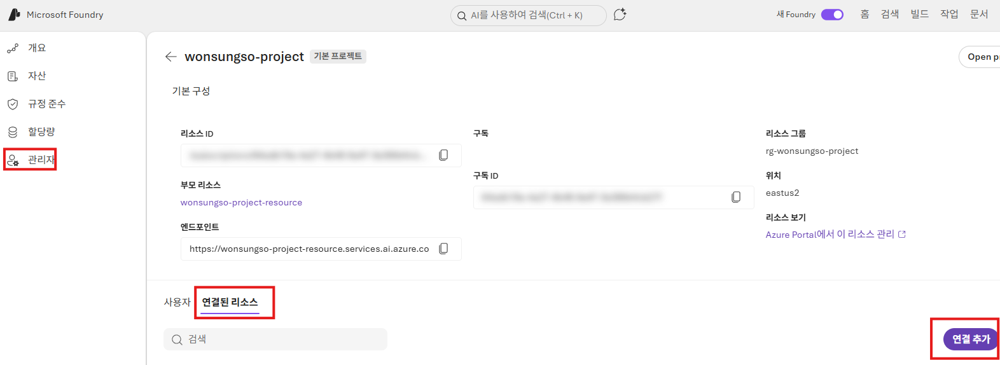

5. `Azure AI Search`를 선택하고 `aisearch-<alias>`를 고른 뒤 인증 유형을 `Microsoft Entra ID`로 선택해 연결합니다.

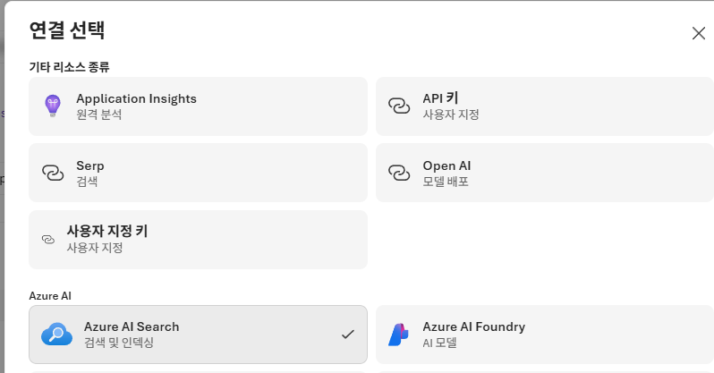

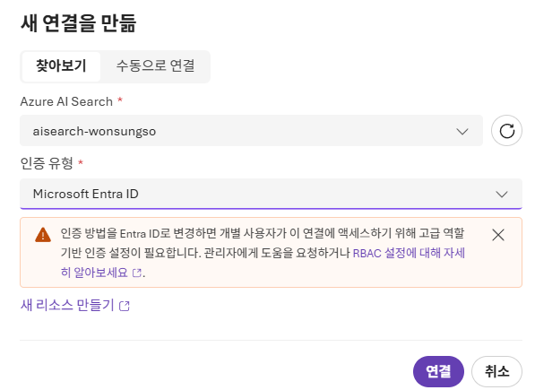

6. 같은 방식으로 `스토리지 계정`도 연결합니다.

> 참고
> 일부 화면에서는 플레이그라운드의 데이터 추가 마법사에서 리소스를 직접 선택할 수도 있습니다. 하지만, 프로젝트 연결이 먼저 되어 있으면 이후 단계가 더 단순해집니다.

### 데이터 연결 권한 구성

Microsoft Foundry 및 AI Search, Blob Storage 간 서비스가 연결되기 위해서는 아래와 같은 역할 할당이 필요합니다.


**Foundry 프로젝트 → Azure AI Search 에 접근하기 위해 필요한 권한**

1. [Azure 포털](https://portal.azure.com)에서 상단 검색창에서 `AI Search`을 검색하여 `Azure Search` 화면으로 이동합니다.
2. 리소스 목록에서 생성한 `aisearch-<alias>`를 클릭합니다.
3. 왼쪽 메뉴에서 `액세스 제어(IAM)` 메뉴를 클릭합니다.
4. 상단 `추가` 버튼을 클릭하고 `역할 할당 추가`를 클릭합니다.
5. 역할 탭에서 `검색 인덱스 데이터 읽기 권한자`를 검색하여 클릭하고 `다음` 버튼을 클릭합니다.
6. 구성원 탭, 다음에 대한 액세스 할당에서 `관리 ID`를 선택하고 `+ 구성원 선택`을 클릭합니다.
7. **관리 ID**에서 `Azure AI Foundry 프로젝트`를 선택하고 목록에서 현재 프로젝트를 클릭하고 `선택` 버튼을 클릭합니다.
8. `검토 + 할당` 버튼을 클릭합니다.
9. 같은 방법으로 역할 탭 `작업 기능 역할`에서 `Search Service 참가자`를 클릭합니다.
10. **관리 ID**에서 `Azure AI Foundry 프로젝트`를 선택하고 목록에서 현재 프로젝트를 클릭하고 `선택` 버튼을 클릭합니다.
11. `검토 + 할당` 버튼을 클릭합니다.

**계정에 스토리지 권한 할당**

1. [Azure 포털](https://portal.azure.com)에서 상단 검색창에서 `스토리지 계정`을 검색하여 스토리지 센터 화면으로 이동합니다.
2. 리소스 목록에서 생성한 `st<alias>project`를 클릭합니다.
3. 왼쪽 메뉴에서 `액세스 제어(IAM)` 메뉴를 클릭합니다.
4. 상단 `추가` 버튼을 클릭하고 `역할 할당 추가`를 클릭합니다.
5. `역할` 탭에서 `Storage Blob 데이터 Contributor`를 검색하여 클릭하고 `다음` 버튼을 클릭합니다.
6. 구성원 탭, 다음에 대한 액세스 할당에서 `사용자, 그룹 또는 서비스 주체`를 선택하고 `+ 구성원 선택`을 클릭합니다.
7. 본인 계정을 입력하여 선택하고 `선택` 버튼을 클릭합니다.
8. `검토 + 할당` 버튼을 클릭합니다.

**서비스에 스토리지 권한 할당**

1. 상단 검색창에서 `스토리지 계정`을 검색하여 스토리지 센터 화면으로 이동합니다.
2. 리소스 목록에서 생성한 `st<alias>project`를 클릭합니다.
3. 왼쪽 메뉴에서 `액세스 제어(IAM)` 메뉴를 클릭합니다.
4. 상단 `추가` 버튼을 클릭하고 `역할 할당 추가`를 클릭합니다.
5. `역할` 탭 **작업 기능 역할**에서 `Storage Blob 데이터 Reader`를 검색하여 클릭하고 `다음` 버튼을 클릭합니다.
6. 구성원 탭, 다음에 대한 액세스 할당에서 `관리 ID`를 선택하고 `+ 구성원 선택`을 클릭합니다.
7. **관리 ID**에서 `Search Service`를 선택하고 목록에서 `aisearch-<alias>`을 클릭하고 `선택` 버튼을 클릭합니다.
8. `검토 + 할당` 버튼을 클릭합니다.
9. 같은 방법으로 역할 탭 `작업 기능 역할`에서 `Storage Blob 데이터 Contributor`를 클릭합니다.
10. **관리 ID**에서 `Azure AI Foundry 프로젝트`를 선택하고 목록에서 현재 프로젝트를 클릭하고 `선택` 버튼을 클릭합니다.
11. 마지막으로 역할 탭 `작업 기능 역할`에서 `독자`를 클릭합니다.
12. **관리 ID**에서 `Azure AI Foundry 프로젝트`를 선택하고 목록에서 현재 프로젝트를 클릭하고 `선택` 버튼을 클릭합니다.
13. `검토 + 할당` 버튼을 클릭합니다.

## 데이터 추가

이번 실습에서는 아래 텍스트 파일을 RAG 데이터로 사용합니다.

- [train-00000-of-00001.txt](https://github.com/wonsungso/AzureAIFoundryWorkshop/blob/main/assets/train-00000-of-00001.txt)

금융 도메인의 뉴스, 금융 보고서, 용어 사전 등이 포함된 문서 + QA 짝으로 구성된 데이터셋으로, 챗봇 학습 및 평가용으로 유용합니다.

### 플레이그라운드 파일 업로드 및 테스트

이 단계에서는 Blob/지식 기반을 먼저 만들지 않아도, 플레이그라운드의 `파일 업로드`만으로 바로 RAG 테스트를 진행할 수 있습니다.

1. [Microsoft Foundry 포털](https://ai.azure.com/)에서 현재 프로젝트에 배포된 모델 `gpt-4o`의 플레이그라운드로 이동합니다.
2. 우측 패널 `도구`에서 `파일 업로드`를 클릭합니다.
3. `파일 첨부` 팝업에서 아래처럼 설정합니다.
    - 인덱스 옵션: `새 인덱스 만들기` (처음 테스트 시)
    - 벡터 인덱스 이름(예시): `finance-article-playground`
    - 파일: [train-00000-of-00001.txt](./../assets/train-00000-of-00001.txt) 선택
4. 좌측 메뉴 `지식` > `인덱스` 로 이동하여, 생성한 인덱스가 존재하는지 목록에서 확인합니다.

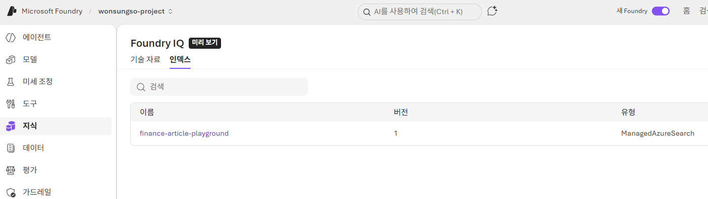

5. 다시 한번 `gpt-4o` 모델의 플레이그라운드에서 `도구` > `파일 업로드`를 다시 한번 클릭한 후 생성한 인덱스를 선택/연결 합니다.

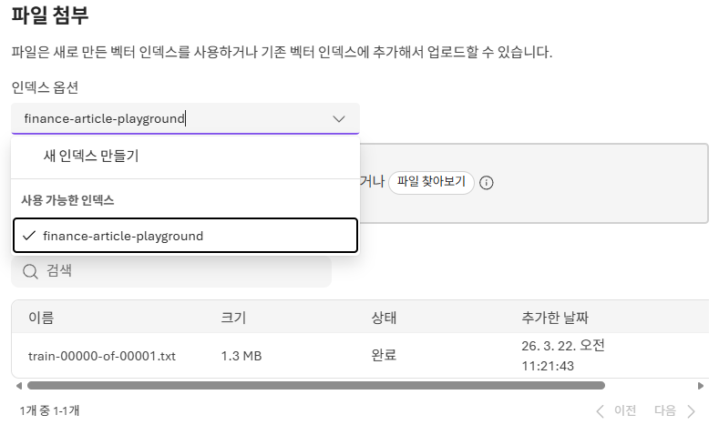

6. 채팅 플레이그라운드의 `지침` 영역에 아래 프롬프트를 붙여 넣습니다.

```text
당신은 대한민국 은행의 금융상품 전문가 챗봇입니다. 고객이 예금, 적금, 펀드, 대출 등 금융상품에 대해 질문하면, 다음 기준을 준수하여 답변해 주세요:

정확한 최신 정보 제공 - 상품 금리, 만기, 우대 조건 등을 가능한 최근 기준으로 제시할 것.

정보 출처 명시 - "은행 내부 상품 카탈로그" 또는 "업로드된 금융 상품 문서"처럼 출처를 밝힐 것.

비교와 계산 - 가능하면 간단한 비교표 또는 계산 예제를 포함할 것.

고객 이해도 고려 - 어려운 금융 용어는 풀어 설명하고, 선택지를 판단할 수 있도록 장단점을 제시할 것.

정책과 규제 준수 - 개인정보 보호, 약관, 금리 고지 사항 등을 반영하여 설명할 것.
```

7. `도구` 추가 및 `지침` 입력이 완료되면 아래 질문으로 문서 기반 응답 여부를 확인합니다.

- **CBDC 관련**
    - CBDC가 국경간 자금세탁 및 불법자금 거래에 악용될 가능성이 있나요?
    - CBDC가 은행 예금을 대체하면 어떤 부작용이 생길 수 있나요?
- **고령화와 저축**
    - 저출산과 고령화가 가계 저축률에 어떤 영향을 미치나요?
    - 우리나라가 고령화에 대응하기 위해 어떤 정책적 대책을 마련해야 하나요?
- **기업대출**
    - 우리나라 은행들이 기업대출을 통해 산업 성장에 어떤 기여를 했나요?
    - 은행의 기업대출이 중소기업의 부가가치 성장에 미친 영향을 설명해줘.
- **경제 성장**
    - 명목 경제성장률이 높다는 것이 경기 호황을 의미하는 이유는 무엇인가요?
    - 대기업들의 중소기업에 대한 부당행위를 근절하면 어떤 긍정적인 효과가 있나요?
- **예금·모기지 관련**
    - 핵심예금(core deposits)의 종류에는 어떤 것들이 있나요?
    - 유동화 방식과 역모기지 방식의 차이점은 무엇인가요?

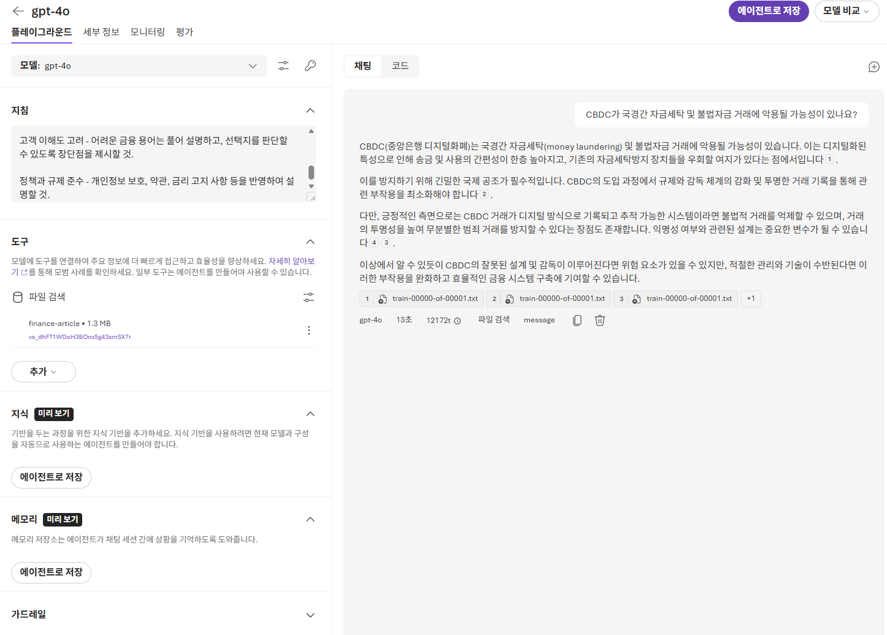

---

이제 2번 모듈 실습(플레이그라운드 파일 업로드 기반 테스트)이 완료되었습니다.
다음 모듈에서 첫 번째 에이전트를 구현해 보겠습니다.

➡️ [3. 첫 번째 에이전트 구현해보기](./../3.%20첫번째%20에이전트%20구현해보기/README.md)
