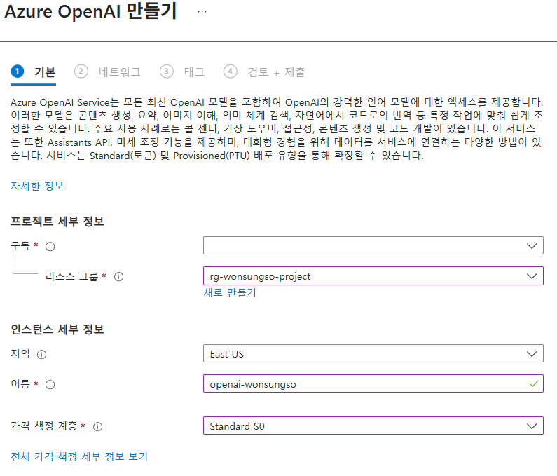

# 2. 플레이그라운드 활용해보기

# 재테크 상담 지원 봇 구성해보기

지금부터 구성해 볼 예제는 “재테크 상담 지원 봇”입니다. 고객이 예금, 적금, 펀드, 대출 상품 등에 대해 물어보면 최신 상품 정보와 계산, 비교 등의 응답을 제공합니다.

## Azure OpenAI 구성

1. 브라우저에서 새 탭을 열고 [Azure 포털](https://portal.azure.com)을 엽니다.
2. 상단 검색창에서 `OpenAI`을 검색하여 **AI Foundry | Azure OpenAI**으로 이동합니다.
3. 상단 `만들기` 버튼을 클릭합니다.
4. 아래와 같이 Azure OpenAI 서비스를 구성합니다.
    
    
    
    - 구독 : 본인 구독 선택
    - 리소스 그룹 : 앞서 복사해 둔 리소스 그룹 선택
    - Region : East US
    - Name : `openai-<alias>`
    - Pricing tier : Standard S0
5. `다음`, `만들기` 버튼을 클릭하여 리소스 생성을 완료합니다.
6. 리소스 배포가 완료되면 `리소스로 이동` 버튼을 클릭합니다.
7. 같은 방법으로 임베딩을 위한 `text-embedding-ada-002` 모델도 배포합니다.

**Azure OpenAI ID 할당**

1. 왼쪽 메뉴에서 `ID`를 클릭합니다.
2. **시스템 할당 항목**에서 **상태**를 `켜기`로 변경하고 `저장` 버튼을 클릭합니다.
    
    
    

### 프로젝트에 Azure OpenAI 연결

1. 브라우저에서 `Azure AI Foundry 탭`으로 이동합니다.
2. 왼쪽 메뉴 하단의 `관리 센터`를 클릭합니다.
3. 왼쪽 프로젝트 섹션에서 `Connected resources`를 클릭합니다.
    
    
    
4. 왼쪽 상단의 `새 연결` 버튼을 클릭합니다.
5. **외부 자산에 연결 추가** 화면에서 `Azure OpenAI`를 클릭합니다.
    
    
    
6. Azure OpenAI 리소스 연결 화면에서 리소스 찾아보기에서 `openai-<alias>를` 찾아 인증을 `Microsoft Entra ID`를 선택하고 연결 추가 버튼을 클릭합니다.
    
    
    
7. 연결 추가가 완료되면 왼쪽 메뉴의 `Go to project` 버튼을 클릭하여 프로젝트 화면으로 돌아갑니다.

### 모델 배포

1. 왼쪽 메뉴에서 하단 `모델 + 엔드포인트`를 클릭합니다.
2. 왼쪽 상단의 `모델 배포` 버튼을 클릭하고 `기본 모델 배포`를 클릭합니다.
3. 모델 선택 화면에서 `gpt-4o`를 검색하고 선택 후, `확인` 버튼을 클릭합니다.
    
    
    
4. **배포 세부 정보**에서 `사용자 지정 버튼`을 클릭하고, 연결된 AI 리소스에서 연결을 구성한  `openai<alias>`를 선택하고 `배포` 버튼을 클릭합니다.
5. 모델 배포가 완료되면 `플레이그라운드에서 열기`를 클릭합니다.
    
    
    

## 초기 프롬프트 구성

초기 프롬프트는 챗봇이 어떤 역할을 하고, 어떤 톤으로 제약 조건 등을 명확히 하는 부분입니다. 이런 기본 프롬프트를 처음에 세팅해 두고, 이후 RAG를 추가하면 더 구체적으로 “검색된 상품 정보를 반영하라” 등의 조건을 넣을 수 있습니다.

1. 왼쪽 설정 부분에서 배포 아래 `모델에 지침 및 컨텍스트 제공`에 아래 프롬프트를 복사하여 붙여 넣습니다.
    
    ```
    당신은 대한민국 은행의 금융상품 전문가 챗봇입니다. 고객이 예금, 적금, 펀드, 대출 등 금융상품에 대해 질문하면, 다음 기준을 준수하여 답변해 주세요:
    
    정확한 최신 정보 제공 — 상품 금리, 만기, 우대 조건 등을 가능한 최근 기준으로 제시할 것.
    
    정보 출처 명시 — “은행 내부 상품 카탈로그” 등 출처를 밝힐 것.
    
    비교 / 계산 가능하면 간단한 비교표 또는 계산 예제 포함 (예: 이율 차이로 얻을 수 있는 이자액 비교).
    
    고객 이해도 고려 — 어려운 금융 용어는 풀어 설명하고, 고객이 선택지를 잘 판단할 수 있도록 장단점 제시.
    
    정책 / 규제 준수 — 개인정보 보호, 약관, 금리 고지 사항 등을 반영하여 설명할 것.
    ```
    
2. 내용이 반영되면 `변경 내용 적용` 버튼을 클릭합니다.
3. 데이터 추가 전 모델만으로는 아래와 같은 일반적인 질문에 대한 프롬프트를 테스트해 볼 수 있습니다.
    
    ```
    정기예금과 적금의 차이를 간단히 설명해 주세요. 각각의 장점과 단점을 알려주세요.
    
    펀드와 ETF의 주요 차이점과 투자 시 유의해야 할 리스크를 3가지씩 설명해 주세요.
    
    대한민국에서 은행 예금은 어느 기관이 예금자보호를 담당하며, 한도는 얼마인가요?
    
    주택담보대출의 LTV와 DSR 규제의 개념과 현재 한국 금융권에서의 적용 방식을 설명해 주세요.
    
    고객이 ‘월 100만원씩 1년간 예금’할 때 단리 3%와 복리 3%의 예상 이자를 비교해 주세요.
    ```
    
    
    

## RAG + 데이터 추가 구성


한국 금융상품 중심으로 접근 가능한 공개 데이터 및 데이터 상품을 다운로드하여 데이터를 추가해 보도록 하겠습니다.

- 데이터 상품 플랫폼
    - [https://github.com/Anna-Jeong-MS/AzureAIFoundryWorkshop-Portal/blob/main/assets/train-00000-of-00001.txt](https://github.com/Anna-Jeong-MS/AzureAIFoundryWorkshop-Portal/blob/main/assets/train-00000-of-00001.txt)
    - 금융 도메인의 뉴스, 금융 보고서, 용어 사전 등이 포함된 문서 + QA 짝으로 구성된 데이터셋. 챗봇 학습 / 평가용으로 유용

### **Azure AI 검색 구성**

1. 상단 검색창에서 `AI 검색`을 검색하여 `AI Foundry | AI Search` 화면으로 이동합니다.
2. 상단의 `만들기` 버튼을 클릭합니다.
3. 아래와 같이 검색 서비스를 구성합니다.
    
    
    
    - 구독 : 구독 선택
    - 리소스 그룹 : Azure AI Foundry 구성에서 복사해 둔 리소스 그룹 이름을 선택
    - 서비스 이름 : `aisearch-<alias>`
    - 위치 : (US) East US
4. 나머지 설정은 그대로 두고, `검토 + 만들기` 버튼을 클릭하여 검색 서비스를 생성합니다.
5. 리소스 배포가 완료되면 `리소스로 이동` 버튼을 클릭합니다.

**AI Search API 액세스 제어 업데이트**

1. 왼쪽 메뉴에서 `설정 > 키`를 클릭합니다.
2. **API 액세스 제어**에서 모두를 클릭합니다.
3. `이 검색 서비스에 대한 API 액세스 제어를 업데이트하시겠습니까?` 팝업이 뜨면 `예` 버튼을 클릭합니다.
    
    
    

**AI Search ID 할당**

1. 왼쪽 메뉴에서 `ID`를 클릭합니다.
2. **시스템 할당 항목**에서 **상태**를 `켜기`로 변경하고 `저장` 버튼을 클릭합니다.
    
    
    

### Azure Blob Storage 구성

1. 상단 검색창에서 스토리지 계정을 검색하여 `스토리지 센터 | 스토리지 계정(Blob)` 화면으로 이동합니다.
2. 상단의 `만들기` 버튼을 클릭합니다.
    
    
    
    - 구독 : 본인 구독 선택
    - 리소스 그룹 : 앞서 복사해 둔 리소스 그룹 선택
    - 스토리지 계정 이름 : `st<alias>project`
    - 지역 : (US) East US
    - 기본 스토리지 유형 : Azure Blob Storage 또는 Azure Data Lake Storage Gen 2
    - 기본 워크로드 : 클라우드 네이티브
    - 중복도 : LRS(로컬 중복 스토리지)
3. 나머지 설정은 그대로 두고 `검토 + 만들기` 버튼을 클릭합니다.
4. 유효성 검사가 끝나면 `만들기` 버튼을 클릭합니다.
5. 배포가 완료되면 `리소스로 이동` 버튼을 클릭합니다.

### 데이터 연결 권한 구성

**Azure AI Foundry 포털**에서 각각의 서비스가 연결되기 위해서는 아래와 같은 역할 할당이 필요합니다.


**Azure OpenAI → Azure AI Search 에 접근하기 위해 필요한 권한**

1. 상단 검색창에서 `AI 검색`를 검색하여 `AI Foundry | Azure Search` 화면으로 이동합니다.
2. 리소스 목록에서 생성한 `aisearch-<alias>`를 클릭합니다.
3. 왼쪽 메뉴에서 `액세스 제어(IAM)` 메뉴를 클릭합니다.
4. 상단 `추가` 버튼을 클릭하고 `역할 할당 추가`를 클릭합니다.
5. 역할 탭에서 `검색 인덱스 데이터 읽기 권한자`를 검색하여 클릭하고 `다음` 버튼을 클릭합니다.
6. 구성원 탭, 다음에 대한 액세스 할당에서 `관리 ID`를 선택하고 `+ 구성원 선택`을 클릭합니다.
7. **관리 ID**에서 `Azure OpenAI`를 선택하고 목록에서 `openai-<alias>`을 클릭하고 `선택` 버튼을 클릭합니다.
8. `검토 + 할당` 버튼을 클릭합니다.
9. 같은 방법으로 역할 탭 `작업 기능 역할`에서 `Search Service 참가자`를 클릭합니다.
10. **관리 ID**에서 `Azure OpenAI`를 선택하고 목록에서 `openai-<alias>`을 클릭하고 `선택` 버튼을 클릭합니다.
11. `검토 + 할당` 버튼을 클릭합니다.

**Azure AI Search → Azure OpenAI 접근 권한**

1. 상단 검색창에서 `OpenAI`를 검색하여 `AI Foundry | Azure OpenAI` 화면으로 이동합니다.
2. 리소스 목록에서 생성한 `openai-<alias>`를 클릭합니다.
3. 왼쪽 메뉴에서 `액세스 제어(IAM)` 메뉴를 클릭합니다.
4. 상단 `추가` 버튼을 클릭하고 `역할 할당 추가`를 클릭합니다.
5. 역할 탭에서 `Cognitive Services OpenAI Contributor`를 검색하여 클릭하고 `다음` 버튼을 클릭합니다.
6. 구성원 탭, 다음에 대한 액세스 할당에서 `관리 ID`를 선택하고 `+ 구성원 선택`을 클릭합니다.
7. **관리 ID**에서 `Search Services`를 선택하고 목록에서 `aisearch-<alias>`을 클릭하고 `선택` 버튼을 클릭합니다.
8. `검토 + 할당` 버튼을 클릭합니다.

**계정에 스토리지 권한 할당**

1. 브라우저에서 새 탭을 열고 [Azure 포털](https://portal.azure.com)을 엽니다.
2. 상단 검색창에서 `스토리지 계정`을 검색하여 스토리지 센터 화면으로 이동합니다.
3. 리소스 목록에서 생성한 `<alias><date>storage`를 클릭합니다.
4. 왼쪽 메뉴에서 `액세스 제어(IAM)` 메뉴를 클릭합니다.
5. 상단 `추가` 버튼을 클릭하고 `역할 할당 추가`를 클릭합니다.
6. `역할` 탭에서 `Storage Blob 데이터 Contributer`를 검색하여 클릭하고 `다음` 버튼을 클릭합니다.
7. 구성원 탭, 다음에 대한 액세스 할당에서 `사용자, 그룹 또는 서비스 주체`를 선택하고 `+ 구성원 선택`을 클릭합니다.
8. 본인 계정을 입력하여 선택하고 `선택` 버튼을 클릭합니다.
9. `검토 + 할당` 버튼을 클릭합니다.

**서비스에 스토리지 권한 할당**

1. 상단 검색창에서 `스토리지 계정`을 검색하여 스토리지 센터 화면으로 이동합니다.
2. 리소스 목록에서 생성한 `st<alias>project`를 클릭합니다.
3. 왼쪽 메뉴에서 `액세스 제어(IAM)` 메뉴를 클릭합니다.
4. 상단 `추가` 버튼을 클릭하고 `역할 할당 추가`를 클릭합니다.
5. `역할` 탭 **작업 기능 역할**에서 `Storage Blob 데이터 Reader`를 검색하여 클릭하고 `다음` 버튼을 클릭합니다.
6. 구성원 탭, 다음에 대한 액세스 할당에서 `관리 ID`를 선택하고 `+ 구성원 선택`을 클릭합니다.
7. **관리 ID**에서 `Search Service`를 선택하고 목록에서 `aisearch-annajeong`을 클릭하고 `선택` 버튼을 클릭합니다.
8. `검토 + 할당` 버튼을 클릭합니다.
9. 같은 방법으로 역할 탭 `작업 기능 역할`에서 `Storage Blob 데이터 Contributor`를 클릭합니다.
10. **관리 ID**에서 `Azure OpenAI`를 선택하고 목록에서 `openai-<alias>`를 클릭하고 `선택` 버튼을 클릭합니다.
11. 마지막으로 역할 탭 `작업 기능 역할`에서 `독자`를 클릭합니다.
12. **관리 ID**에서 `Azure AI Foundry project`를 선택하고 목록에서 `<alias>-project-resource/<alias>-project`를 클릭하고 `선택` 버튼을 클릭합니다.

## 데이터 추가

1. 왼쪽 메뉴에서 `플레이그라운드`를 클릭합니다.
2. `채팅 플레이그라운드 사용해 보기` 버튼을 클릭하고 배포에서 생성한 `gpt-4o 모델`을 선택합니다.
3. 왼쪽 설정 부분에서 데이터 추가 섹션의 `데이터 원본 추가` 버튼을 클릭합니다.
    
    
    
4. 데이터 원본 선택에서 `파일 업로드`를 선택합니다.
5. Azure Blob Storage 리소스 선택에서 생성한 `st<alias>project`를 선택합니다.
6. 하단에 리소스에 대한 `CORS 켜기` 버튼을 클릭합니다.
    
    
    
    
    

1. Azure AI 검색 리소스 선택에서 생성한 `aisearch-<alias>`를 선택합니다.
2. **인덱스 이름을 입력합니다** 항목에 `finance-article`을 입력하고 `다음` 버튼을 클릭합니다.
    
    
    
3. 파일 업로드 단계에서 앞서 다운로드한 `train-00000-of-00001.txt` 파일을 선택합니다.
4. `파일 업로드` 버튼을 클릭합니다.
    
    
    
5. 파일 업로드가 완료되면 `다음` 버튼을 클릭합니다.
6. **데이터 관리 단계**에서 기본 설정을 그대로 두고 `다음` 버튼을 클릭합니다.
    
    
    
7. Azure 리소스 인증 유형을 `시스템이 할당한 관리 ID`로 두고 `다음` 버튼을 클릭합니다.
    
    
    
8. `저장 후 닫기` 버튼을 클릭합니다.
9. 구성이 끝나면 다음과 같이 데이터 수집이 진행되고 데이터가 추가됩니다.
    
    
    
10. 데이터 추가가 완료되면 아래와 같은 프롬프트를 통해 데이터를 기반으로 응답하는지 확인해 볼 수 있습니다.
    
    
    
    - CBDC 관련
        - CBDC가 국경간 자금세탁 및 불법자금 거래에 악용될 가능성이 있나요?
        - CBDC가 은행 예금을 대체하면 어떤 부작용이 생길 수 있나요?
    - 고령화와 저축
        - 저출산과 고령화가 가계 저축률에 어떤 영향을 미치나요?
        - 우리나라가 고령화에 대응하기 위해 어떤 정책적 대책을 마련해야 하나요?
    - 기업대출
        - 우리나라 은행들이 기업대출을 통해 산업 성장에 어떤 기여를 했나요?
        - 은행의 기업대출이 중소기업의 부가가치 성장에 미친 영향을 설명해줘.
    - 경제 성장
        - 명목 경제성장률이 높다는 것이 경기 호황을 의미하는 이유는 무엇인가요?
        - 대기업들의 중소기업에 대한 부당행위를 근절하면 어떤 긍정적인 효과가 있나요?
    - 예금·모기지 관련
        - 핵심예금(core deposits)의 종류에는 어떤 것들이 있나요?
        - 유동화 방식과 역모기지 방식의 차이점은 무엇인가요?

### 재테크 상담 지원 봇 배포

이제 구성한 재테크 상담 지원 봇을 배포해보도록 하겠습니다.

1. 상단의 `배포` 버튼을 클릭하고 `…웹앱으로` 버튼을 클릭합니다.
2. 아래와 같이 구성하고 `배포` 버튼을 클릭합니다.
    - 이름 : FinPilot-<alias>
    - 구독 : 본인 구독 선택
    - 리소스 그룹 : Azure AI Foundry 구성에서 복사해 둔 리소스 그룹 이름을 선택
    - 위치 : Korea Central
    - 가격 책정 플랜 : Standard (S1)
    - 웹앱에서 채팅 기록 사용 체크
    
    
    
3. 상단 웹앱 배포 중 알림의 `배포 탭`을 클릭하여 배포 상태를 확인할 수 있습니다.
    
    
    
4. 리스트에서 `FinPilot-<alias>` 의 관리(Azure Portal)를 클릭합니다.
5. 왼쪽 메뉴에서 `설정 > 인증`을 클릭합니다.
6. `ID 공급자 추가` 버튼을 클릭합니다.
7. ID 공급자에서 `Microsoft`를 클릭하고 아래와 같이 구성합니다.
    - 애플리케이션 및 해당 사용자에 대한 테넌트 선택 : 인력 구성(현재 테넌트)
    - 항목이 뜨지 않을 경우 생략
        - 앱 등록 유형 : 새 앱 등록 만들기
        - 이름 : FinPilot-<alias>
        - 서비스 트리 ID :
    - App Service 인증 설정 > 액세스 제한 : 인증되지 않은 액세스 허용
8. 나머지 설정은 그대로 두고 `추가` 버튼을 클릭합니다.
9. 다시 Azure AI Foundry 포털로 돌아와 웹앱 리스트에서 `FinPilot-<alias>`를 클릭하면 새 탭에서 [`https://finpilot-<alias>.azurewebsites.net/`](https://finpilot-annajeong.azurewebsites.net/) 사이트가 열리고 화면을 확인할 수 있습니다.
    
    
