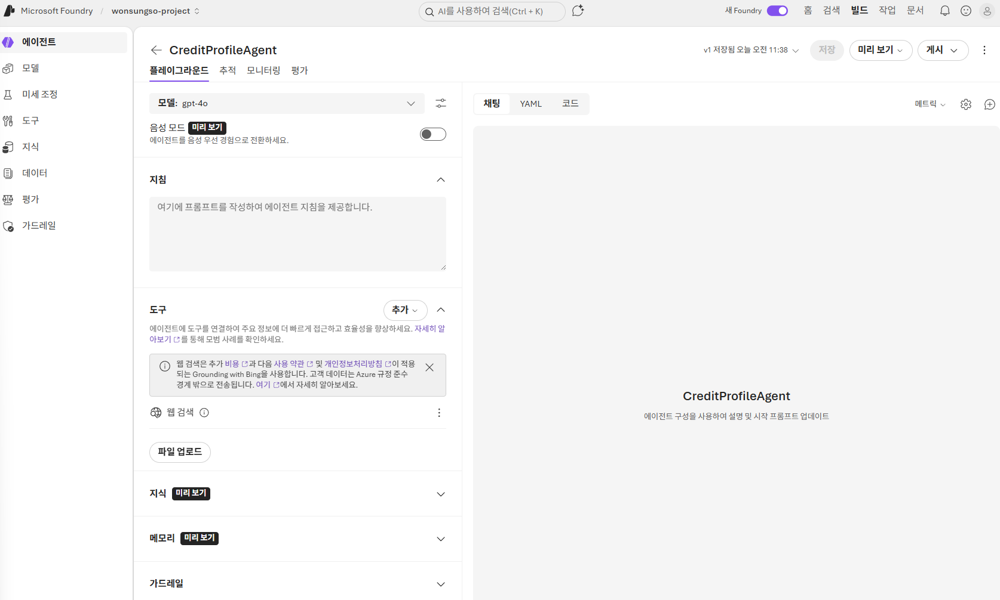
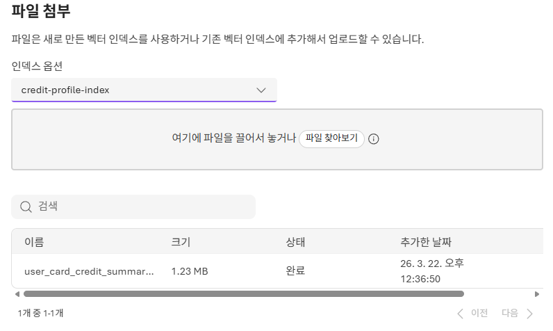
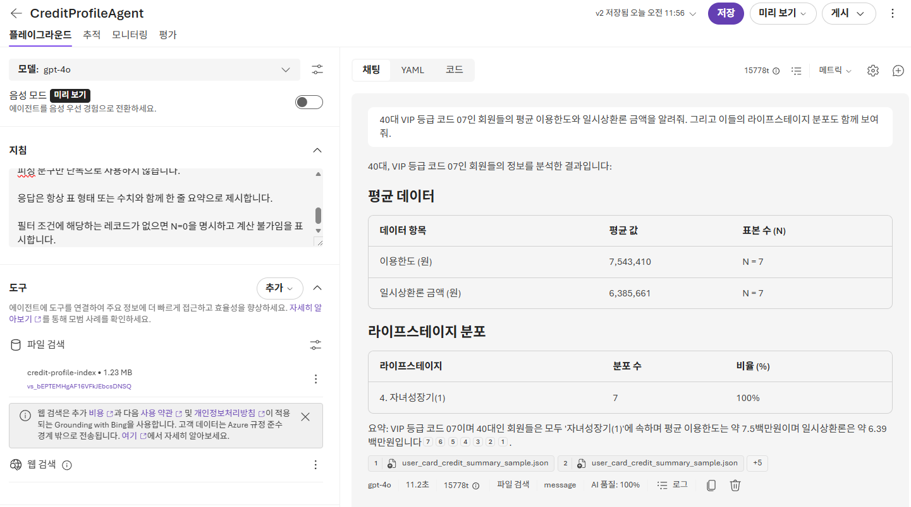

# 3. 첫번째 에이전트 구현해보기

이번 모듈에서는 [Microsoft Foundry 포털](https://ai.azure.com/)의 **에이전트 만들기 및 디버그** 화면과 **플레이그라운드 사용 보기** 기능을 사용해 카드회원 분석용 에이전트를 만듭니다.

## 에이전트 플레이그라운드 열기

1. [Microsoft Foundry 포털](https://ai.azure.com/)을 엽니다.
2. 현재 프로젝트를 선택합니다.
3. 우측 상단에서 `빌드`를 클릭한 뒤 왼쪽 메뉴에서 `에이전트`를 클릭합니다.
4. `에이전트 만들기`를 클릭하여 에이전트를 만듭니다.

- 에이전트 이름 : `CreditProfileAgent`

5. 에이전트 생성 후 `플레이그라운드` 화면에서 모델: `gpt-4o` 모델을 확인 및 설정합니다.

## 에이전트 화면 구성 요소



- `모델`: 에이전트가 답변 생성에 사용할 기본 모델(`gpt-4o`)을 선택하고 필요 시 다른 배포 모델로 전환하는 영역입니다.
- `음성 모드(미리 보기)`: 음성으로 질문하고 음성으로 답변받는 보이스 기반 대화를 켜고 테스트하는 기능입니다.
- `지침`: 에이전트의 역할, 말투, 출력 형식, 제한 조건을 정의하는 시스템 프롬프트를 작성하는 핵심 설정입니다.
- `도구`: `웹 검색`, `파일 업로드` 같은 기능을 연결해 에이전트가 실제 작업을 수행할 수 있도록 확장하는 영역입니다.
- `지식(미리 보기)`: 답변에 활용할 문서와 인덱스를 연결해 근거 기반 검색이 동작하도록 설정하는 영역입니다.
- `메모리(미리 보기)`: 사용자별 대화 이력을 유지해 이전 맥락을 반영한 연속성 있는 응답을 가능하게 하는 기능입니다.
- `가드레일`: 금지 주제, 안전 정책, 응답 제한을 적용해 에이전트의 출력 리스크를 줄이고 동작을 통제하는 보호 장치입니다.

## 카드회원 분석 에이전트 구현

이 에이전트는 카드회원 요약 데이터를 기반으로 조건에 맞는 프로필을 추출하고 간단한 집계를 수행합니다.

### 데이터 설명

- 공통 키: `발급회원번호`, `기준년월`
- 주요 속성
  - 익명화된 회원 ID
  - 연령, 지역, 성별, VIP 등급
  - 마케팅 동의 여부
  - 최근 3개월 사용금액
  - 이용한도, 한도 증액 요청, 연체 관련 정보

직접 식별자는 포함되어 있지 않으며, 익명화된 데이터 기반으로 분석합니다.

### 생성한 Agent에 파일 업로드 통한 지식 추가

1. 위에서 생성한 `CreditProfileAgent`의 플레이그라운드로 이동합니다.

플레이그라운드에서 파일 업로드 기능을 사용하면 자동으로 인덱스가 생성되고 에이전트가 즉시 데이터에 접근할 수 있습니다.

### 단계: 파일 업로드

1. 에이전트 플레이그라운드의 우측 패널 `도구`에서 `파일 업로드`를 클릭합니다.
2. `파일 첨부` 팝업에서 아래처럼 설정합니다.
    - 인덱스 옵션: `새 인덱스 만들기`
    - 벡터 인덱스 이름: `credit-profile-index`
    - 파일: [user_card_credit_summary_sample.json](./../assets/user_card_credit_summary_sample.json) 선택
3. 새 창을 열어 좌측 메뉴 `지식` > `인덱스`로 이동하여, 생성한 인덱스가 존재하는지 목록에서 확인합니다.



4. 다시 한번 에이전트 플레이그라운드에서 우측 패널 `도구` > `파일 업로드`를 클릭한 후 생성한 인덱스 `credit-profile-index` 를 선택/연결합니다.

> **참고**
> - JSON, CSV, PDF, TXT 등 다양한 형식을 지원합니다.
> - 프로덕션 환경에서는 지식 > 추가로 영구 지식 기반을 구성할 수 있습니다.

5. 구성한 에이전트를 저장합니다.

## 에이전트 테스트

`지침`에 아래 내용을 입력합니다.

```text
항상 한국어로 응답합니다.

데이터가 충분하지 않더라도, 가능한 범위에서 실제 수치와 집계 결과를 보여줍니다.

조건에 맞는 데이터가 없으면 "평균 한도금액은 계산할 수 없으며, 표본 수 N=0입니다."처럼 명확히 답합니다.

"곧 업데이트드릴게요" 또는 "더 구체적 데이터가 필요합니다"와 같은 회피성 문구만 단독으로 사용하지 않습니다.

응답은 항상 표 형태 또는 수치와 함께 한 줄 요약으로 제시합니다.

필터 조건에 해당하는 레코드가 없으면 N=0을 명시하고 계산 불가임을 표시합니다.
```

지식 인덱싱이 완료되면 아래 프롬프트로 에이전트를 테스트합니다.

```text
40대 VIP 등급 코드 07인 회원들의 평균 이용한도와 일시상환론 금액을 알려줘. 그리고 이들의 라이프스테이지 분포도 함께 보여줘.

최근 카드 발급 경과월이 5개월 이하이고 단기연체 여부(6M)가 1인 회원 정보를 찾아 요약해줘. 회원번호, 연령대, 이용한도, 연체 관련 필드만 표시해.

자녀성장기(1)와 자녀성장기(2) 단계에 있는 30대와 40대 회원들의 평균 이용한도를 비교해 보고, 한도가 높은 순으로 라이프스테이지와 연령대 조합을 정렬해줘.
```

응답을 확인할 때 다음을 확인합니다.

- 입력한 지침을 정확히 따르는지
- 조건 필터가 정확히 반영되는지
- 업로드한 데이터 기반의 결과를 반환하는지



---

이제 3번 모듈 실습(첫 번째 에이전트 구현)이 완료되었습니다.
다음 모듈에서 멀티 에이전트를 구현해 보겠습니다.

➡️ [4. 멀티 에이전트 구현해보기](./../4.%20멀티%20에이전트%20구현해보기/README.md)