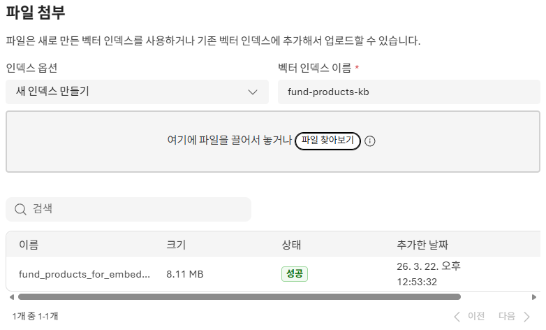
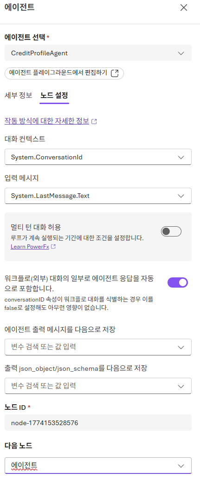
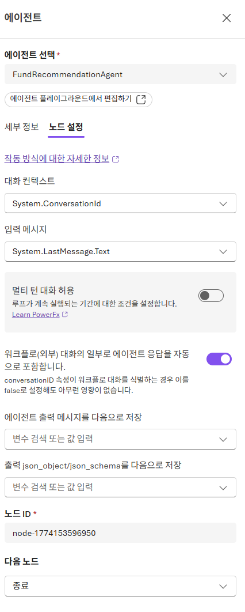
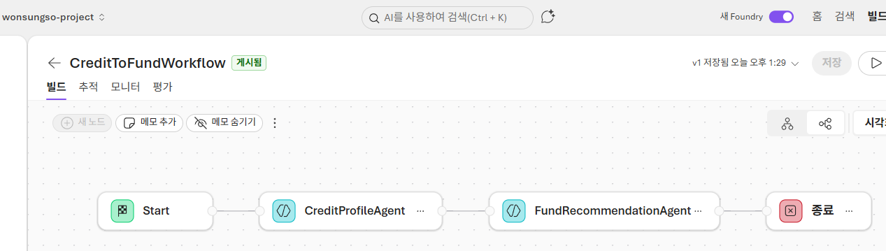
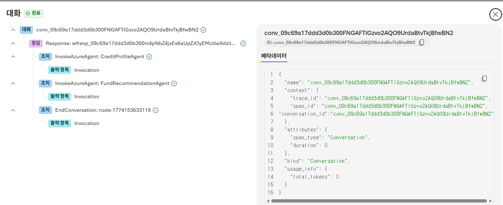

# 4. 멀티 에이전트 구현해보기

멀티 에이전트는 역할이 다른 에이전트들이 협업해 문제를 단계적으로 해결하는 패턴입니다.

이번 실습에서는 다음 흐름을 구성합니다.

1. `CreditProfileAgent`가 사용자 조건에 맞는 프로필을 찾습니다.
2. `FundRecommendationAgent`가 그 결과를 받아 펀드 상품을 추천합니다.

## 멀티 에이전트 시나리오

첫 번째 에이전트에서 도출할 수 있는 사용자 조건 예시는 아래와 같습니다.

```text
VIP 등급 코드가 07이고, 이용한도가 5백만 원 이상인 사용자를 추출해줘. 회원번호와 라이프스테이지를 함께 보여줘.

40대 자녀성장기(1) 단계에 있는 여성 회원 중 최근 카드 발급 경과월이 12개월 이하인 사용자를 찾아줘.

최근 6개월 단기연체 여부가 1인 사용자를 추출하고, 회원번호, 연령대, 이용한도를 정리해줘.

이용한도가 1천만 원 이상이고 일시상환론 금액이 5백만 원 이상인 사용자를 찾아줘.

20대 가족형성기 단계의 남성 회원 중 카드 신청 건수가 1건 이상인 사용자를 뽑아줘.

60대 이상 노령 라이프스테이지 회원 중 이용가능 회원만 추려줘.
```

이렇게 추출한 프로필을 공모펀드 속성과 연결하면, 연령대, 위험선호, 라이프스테이지에 따라 추천 로직을 만들 수 있습니다.

## FundRecommendationAgent 생성

1. [Microsoft Foundry 포털](https://ai.azure.com/)에서 `빌드 > 에이전트`로 이동합니다.
2. `에이전트 만들기`를 클릭합니다.
3. 에이전트 이름을 `FundRecommendationAgent`로 입력합니다.
4. 사용할 모델은 앞 단계에서 배포한 `gpt-4o` 계열 모델을 선택합니다.
5. `지침`에 아래 내용을 입력후 저장합니다.

```text
역할: 워크플로 1단계(CreditProfileAgent) 결과로 전달된 사용자 페르소나를 바탕으로, 지식에 업로드된 펀드 상품 데이터를 이용해 해당 사용자에게 적합한 공모펀드 상품을 한국어로 추천한다.

동작 절차:
1) 워크플로 입력과 1단계 결과에서 타깃 사용자 조건을 확인한다.
2) 전달받은 페르소나를 JSON 배열로 해석한다.
3) 페르소나를 바탕으로 위험등급, 자산유형, 지역, 스타일과 테마, 수수료 등을 기준으로 펀드 후보를 좁힌다.
4) 후보를 3~5개로 요약 추천하고, 사용자 조건과 펀드 속성의 매핑 근거를 설명한다.

응답 구조:
- 요약: 사용자 조건
- 추천: 펀드 3~5개, 핵심 속성, 추천 사유
- 근거: 어떤 규칙과 속성 매핑으로 추천했는지

규칙:
- 반드시 한국어로 답변한다.
- 1단계 결과가 비어 있으면 그 사유를 설명하고 조건 완화를 제안한다.
```
## 지식 추가

펀드 상품 데이터를 [fund_products_for_embedding_part_001.json](./../assets/fund_products_for_embedding_part_001.json) 파일로 추가합니다.

### 파일 업로드 단계

1. FundRecommendationAgent 플레이그라운드에서 우측 패널 `도구`에서 `파일 업로드`를 클릭합니다.
2. `파일 첨부` 팝업에서 아래처럼 설정한 후 `연결` 버튼을 클릭합니다.
    - 인덱스 옵션: `새 인덱스 만들기`
    - 벡터 저장소 이름: `fund-products-kb`
    - 파일: [fund_products_for_embedding_part_001.json](./../assets/fund_products_for_embedding_part_001.json) 선택
3. 새 창을 열어 좌측 메뉴 `지식` > `인덱스`로 이동하여, 생성한 지식이 존재하는지 목록에서 확인합니다.



4. 다시 한번 에이전트 플레이그라운드 창을 새로고침 한 후 우측 패널 `도구` > `파일 업로드`를 클릭하여 생성한 지식을 선택/연결합니다.

> **데이터 구성**
> - 상품코드, 상품명, 자산유형, 위험등급, 지역, 스타일과 테마, 운용사, 보수 정보 포함
> - 에이전트가 사용자 프로필과 펀드 속성을 매핑하는 기반이 됨

## 워크플로 통한 멀티 에이전트 구성

1. [Microsoft Foundry 포털](https://ai.azure.com/)에서 `빌드 > 에이전트`로 이동합니다.
2. 상단 탭에서 `워크플로(미리 보기)`를 선택합니다.
3. 우측 상단 `만들기`를 클릭하고 `빈 워크플로`를 선택합니다.
4. 캔버스에 `Start`노드가 생성되면, 워크플로 노드 추가 항목에서 `에이전트` 노드를 생성 합니다.
5. 첫번째 `CreditProfileAgent` 노드를 설정하기 위해 `노드 설정`에서 아래 값을 입력한 후 `완료` 버튼을 클릭합니다.

`CreditProfileAgent` 노드
- 에이전트 선택: `CreditProfileAgent`
- 대화 컨텍스트: `System.ConversationId`
- 입력 메시지: `System.LastMessage.Text`
- 워크플로(외부) 대화의 일부로 에이전트 응답 자동 포함: `켜기`
- 에이전트 출력 메시지 값 다음으로 저장: 비움 (기본값)
- 출력 json_object/json_schema 값 다음으로 저장: 비움 (기본값)
- 다음 노드: 에이전트



6. 다음 생성된 에이전트를 `FundRecommendationAgent` 노드로 할당 및 설정합니다.

`FundRecommendationAgent` 노드
- 에이전트 선택: `FundRecommendationAgent`
- 대화 컨텍스트: `System.ConversationId`
- 입력 메시지: `System.LastMessage.Text`
- 워크플로(외부) 대화의 일부로 에이전트 응답 자동 포함: `켜기`
- 에이전트 출력 메시지 값 다음으로 저장: 비움 (기본값)
- 출력 json_object/json_schema 값 다음으로 저장: 비움 (기본값)
- 다음 노드: `종료`



8. 상단 `저장`을 클릭하고 워크플로 이름을 입력합니다. (예: `CreditToFundWorkflow`)



9. 상단 `미리보기`에서 테스트 프롬프트를 실행해 단계별 결과를 확인합니다.

> 참고
> - 워크플로 캔버스에서 각 노드가 저장 완료되면 준비 상태로 표시됩니다.
> - `추적`, `모니터`, `평가` 탭에서 실행 흐름과 결과를 확인할 수 있습니다.

## 멀티 에이전트 테스트

워크플로 `Preview`에서 아래 프롬프트로 테스트합니다.

```text
40대 VIP 등급 코드 07인 사용자를 대상으로 적합한 펀드를 추천해줘.
연체 이력은 없어야 하고, 성장형 위주의 글로벌 주식형이면 좋아.
```

```text
자녀성장기(1) 단계의 30대 고객에게 균형형 혼합형 펀드 3가지만 추천해줘.
```

테스트 시 다음을 확인합니다.

- 1단계(`CreditProfileAgent`)가 사용자 조건을 제대로 해석하는지
- 2단계(`FundRecommendationAgent`)가 1단계 결과를 바탕으로 추천하는지
- 추천 사유가 펀드 속성과 사용자 특성을 함께 설명하는지



---

이제 4번 모듈 실습(멀티 에이전트 구현)이 완료되었습니다.

이것으로 **Microsoft Foundry 워크샵의 모든 실습**을 마쳤습니다. 🎉

이 워크샵에서 학습한 내용을 정리하면 다음과 같습니다.

| 모듈 | 내용 |
|---|---|
| 1. Microsoft Foundry 구성 | Foundry 프로젝트 생성 및 Azure 리소스 준비 |
| 2. 플레이그라운드 활용해보기 | gpt-4o 모델 배포, 시스템 프롬프트 구성, 파일 업로드 기반 RAG 테스트 |
| 3. 첫번째 에이전트 구현해보기 | CreditProfileAgent 생성 및 카드회원 분석 에이전트 구현 |
| 4. 멀티 에이전트 구현해보기 | FundRecommendationAgent + 빈 워크플로 기반 CreditToFundWorkflow 구성 |

