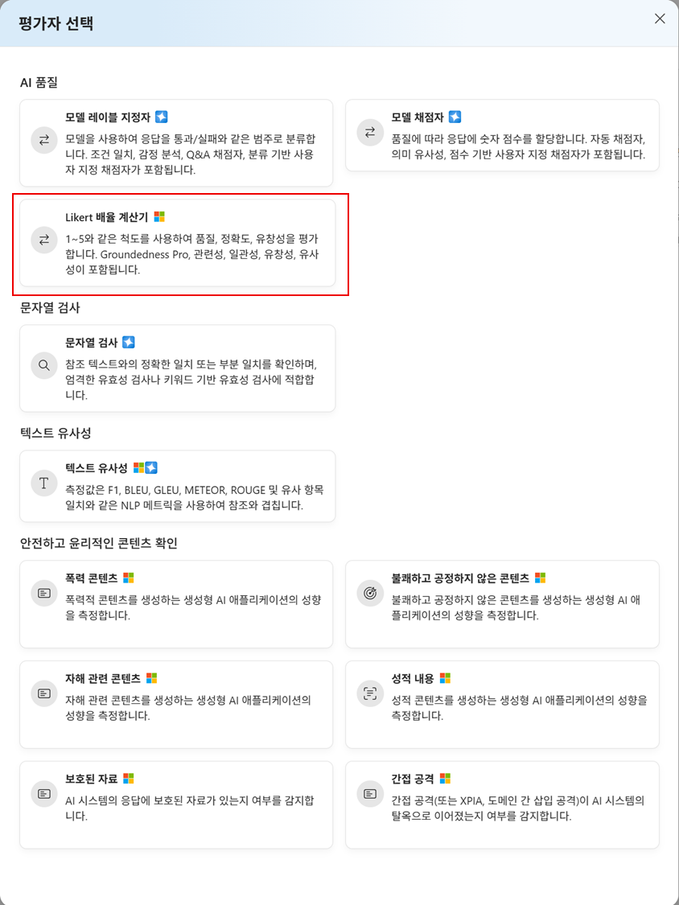
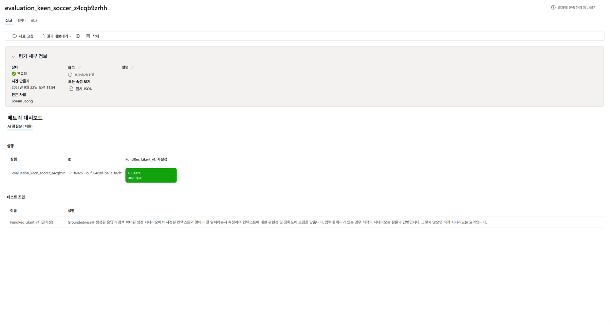
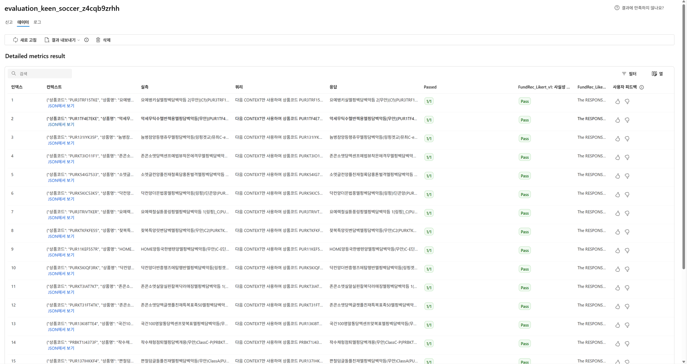

# 5. 평가

생성형 AI 애플리케이션은 모델 자체보다도 **실제 데이터와 프롬프트, 에이전트 설정을 포함한 전체 시스템**의 품질을 평가해야 합니다.

[Microsoft Foundry 포털](https://ai.azure.com/)에서는 모델, 에이전트, 데이터셋을 대상으로 평가를 실행하고 결과를 비교할 수 있습니다.

---

## 애플리케이션 성능 평가 및 비교

이번 실습에서는 `FundRecommendationAgent`의 추천 결과를 데이터셋 기반으로 평가합니다.

금융상품 추천은 정답이 하나로 고정되지 않는 경우가 많기 때문에, 다음과 같은 품질 축을 함께 보는 것이 중요합니다.

- **관련성**: 질문에 맞는 답인지
- **근거성**: 제공된 컨텍스트와 추천 근거가 연결되는지
- **일관성**: 추천 형식과 설명 구조가 안정적인지

## 평가 실행

### 1단계: 테스트 데이터 준비

포털에서 직접 가상 테스트 데이터를 입력해 평가합니다. JSONL 형식으로 다음과 같은 샘플 데이터를 사용합니다.

```jsonl
{"query": "40대 VIP 등급 코드 07인 사용자를 대상으로 적합한 펀드를 추천해줘. 연체 이력은 없어야 하고, 성장형 위주의 글로벌 주식형이면 좋아.", "context": "사용자: 40대, VIP등급 07, 연체 없음, 선호도: 성장형 글로벌 주식", "response": "귀사의 프로필에 맞는 펀드 3가지를 추천합니다: 1) 글로벌 성장주 펀드 - 선진국 성장 기업 중심 2) 이머징마켓 혼합 펀드 - 글로벌 다각화 3) 기술주 집중 펀드 - 장기 성장성"}
{"query": "자녀성장기(1) 단계의 30대 고객에게 균형형 혼합형 펀드 3가지만 추천해줘.", "context": "사용자: 30대, 자녀성장기 1단계, 선호도: 균형형 혼합", "response": "30대 자녀성장기 고객을 위한 균형형 혼합 펀드: 1) 균형형 혼합 1호 - 주식 50%, 채권 50% 2) 생애주기 균형 펀드 - 보수적 배분 3) 유동성 중심 혼합 펀드 - 적절한 수익성"}
{"query": "20대 신혼부부 고객에게 리스크가 낮은 채권형 펀드를 추천해줄 수 있나요?", "context": "사용자: 20대, 신혼부부, 선호도: 저리스크 채권형", "response": "안정적인 채권형 펀드를 추천합니다: 1) 안정형 채권 펀드 - 국고채 중심 2) 회사채 균형 펀드 - AAA 등급 중심 3) MMF형 유동성 펀드 - 단기 안정성"}
```

### 2단계: 평가 데이터 입력

1. [Microsoft Foundry 포털](https://ai.azure.com/)에서 왼쪽 메뉴의 `평가`로 이동합니다.
2. `새 평가 만들기`를 클릭합니다.


3. 평가 대상 워크플로우에서 **`CreditToFundWorkflow`** 를 선택합니다.
4. 평가 목표 데이터셋으로 기존 데이터셋을 선택하거나, **`새 데이터 세트 생성`** 을 클릭합니다.


5. 데이터셋 생성 다이얼로그에서 다음을 입력합니다.
   - **세 데이터 세트의 이름**: `creditofundworkflow_977yr2ccf` (자동 생성됨)
   - **모델**: `gpt-4o` 선택
   - **용량**: 90 (기본값)


6. **프롬프트** 필드에 위의 JSONL 샘플 데이터를 붙여넣습니다.
7. **시드 데이터** 섹션의 **파일 선택**에서 테스트 데이터 파일을 선택하거나, 직접 입력합니다.
8. **생성**을 클릭해 가상 데이터셋을 생성합니다.

> **팁**
> 포털의 데이터 세트 생성 방식을 사용하면:
> - 포털에서 자동으로 가상 데이터를 생성
> - 빠르게 평가 프로세스를 체험할 수 있음
> - 실제 데이터로는 [fund_products_eval_sample.jsonl](./../assets/fund_products_eval_sample.jsonl) 파일을 사용

### 3단계: 평가 조건 설정

1. **조건 탭**에서 평가할 에이전트와 데이터셋이 올바르게 선택되었는지 확인합니다.


   - 대상: CreditToFundWorkflow (워크플로우)
   - 데이터 세트: creditofundworkflow_977yr2ccf (방금 생성한 데이터셋)

2. 조건이 확실하면 **다음**을 클릭합니다.

## 평가자 선택 및 검토

[Microsoft Foundry 포털](https://ai.azure.com/)에서는 품질 평가자와 안전 평가자를 함께 선택할 수 있습니다. 이번 실습에서는 품질 평가 위주로 진행합니다.

1. **평가자 선택** 단계에서 다음을 수행합니다.
   - `Likert 배율 계산기`를 우선 선택합니다.
   - 필요하면 `모델 채점자`나 다른 품질 평가자를 추가합니다.
   - AI judge 모델이 필요한 평가자라면 `gpt-4o` 또는 `gpt-4o-mini` 선택

2. **필드 매핑** 화면에서 데이터 구조를 다음과 같이 연결합니다.
   - **쿼리**: `query` (사용자의 펀드 추천 요청)
   - **응답**: `response` (워크플로우가 생성한 추천)
   - **컨텍스트**: `context` (사용자 프로필 정보)

3. **검토** 탭에서 평가 설정을 최종 확인합니다.


   - **평가 대상**: CreditToFundWorkflow: v1
   - **데이터 세트**: creditofundworkflow_977yr2ccf
   - **평가자**: 선택한 평가자 목록 (Likert, 모델 채점자 등)
   - **에이전트 랭킹**: 평가 대상 에이전트

4. 전체 설정이 올바르면 **제출**을 클릭해 평가를 시작합니다.



> **필드 매핑 확인**
> - `query`: 포털에 입력한 JSON의 `"query"` 필드
> - `response`: 포털에 입력한 JSON의 `"response"` 필드  
> - `context`: 포털에 입력한 JSON의 `"context"` 필드
>
> 이 필드들이 테스트 데이터에 정확히 매핑되어야 평가가 정상 실행됩니다.

## 결과 확인

평가가 완료되면 상단 탭에서 결과를 확인합니다.

- **선고 탭**: 평가 실행 상태, 메트릭 대시보드, 평가자별 통과율 요약
- **데이터 탭**: 행 단위 상세 결과 (`Detailed metrics result`). 각 샘플의 점수, Pass/Fail, 컨텍스트·쿼리·응답 내용을 비교할 수 있습니다.

평가 이름에 `FundRec_Likert_v1`처럼 버전 정보를 포함하면 이후에 프롬프트를 수정한 뒤 새 평가결과와 비교하기 쉽습니다.





## 해석 포인트

테스트 데이터로 평가한 결과를 분석할 때 다음 항목들을 중점적으로 봅니다.

- **관련성 (Relevance)**
    - 워크플로우가 사용자의 펀드 추천 요청을 정확히 이해했는지
    - "40대 VIP"는 연령과 등급을 함께 고려했는지
    - "글로벌 주식형"이라는 선호도를 반영했는지
    
- **근거성 (Groundedness)**
    - 추천 펀드가 컨텍스트(사용자 프로필)와 실제로 연결되는지
    - 예: "자녀성장기" → "균형형 혼합 펀드" 추천이 논리적인지
    - 펀드 속성 설명이 가상 데이터와 일치하는지
    
- **일관성 (Consistency)**
    - 3가지 테스트 케이스 모두에서 응답 형식이 통일되는지
    - 각 응답이 동일한 구조(1) 펀드명 2) 특징 3) 선택 이유)를 유지하는지
    - 응답 길이와 표현이 적절한지

**평가 결과 해석 예시:**
- ✅ 모든 쿼리에서 관련성 4~5점 → 워크플로우가 요청을 잘 이해함
- ⚠️ 근거성이 2~3점 → CreditProfileAgent의 프로필 분석이 부정확할 수 있음
- ⚠️ 일관성이 낮음 → FundRecommendationAgent의 지침 재조정 필요

**다음 단계:**
1. 평가 결과를 분석해 점수가 낮은 항목 파악
2. 해당 에이전트의 지침 또는 프롬프트 수정
3. 수정 후 같은 테스트 데이터로 재평가해 개선 정도 확인
4. 실제 데이터로도 평가 실행해 일반화 검증